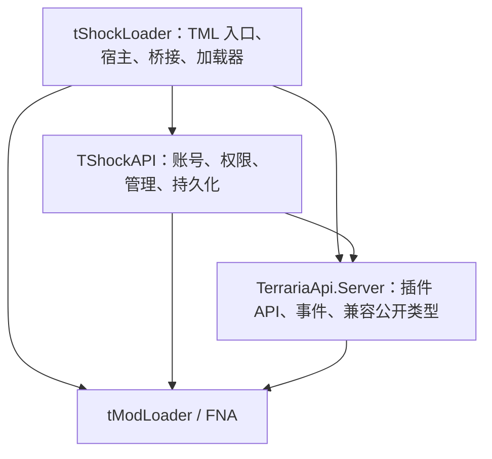

# TShock Loader 架构与设计方针

> 状态：已确定的目标设计；当前源码处于原型阶段，本文不代表功能已经实现或验证。
>
> 阅读顺序：本文 → [运行时与兼容契约](docs/runtime-contracts.md) → [开发路线与验收](docs/development-roadmap.md)。

## 1. 产品定位

TShock Loader 为 tModLoader Dedicated Server 提供 TShock 的管理能力和插件生态。TShock 是必需核心组件，用户安装一个完整发行包即可使用；第三方插件通过 `ServerPlugins/` 安装。

产品能力按以下顺序建设：

1. 账号、权限、命令、封禁、日志和基础管理。
2. 正确适配 TML 网络、动态内容和世界生命周期。
3. 使用本项目 SDK 重新编译的 TShock 插件。
4. 经过测试的旧版 TShock 二进制插件兼容。
5. 具有明确数据契约的模组角色持久化。

首个可用版本面向纯服务端部署，SSC 默认关闭。完整模组 SSC 另设里程碑，在服务器数据可见性、恢复和同步经过验证之后启用。插件更新以服务器进程重启为边界。

首期第三方插件共享一个依赖解析域，同名托管依赖采用单一版本；多版本私有依赖隔离不在首期能力范围。

## 2. 核心决策

| 编号 | 决策 | 直接影响 |
|---|---|---|
| A01 | TShock 必需内置，保留独立 `TShockAPI.dll` | 整体发布、显式创建、版本配套验证 |
| A02 | 三个项目，依赖单向 | Loader 负责组装，API 提供契约，TShock 提供管理功能 |
| A03 | TML 是游戏状态、内容注册和网络协议的权威来源 | 适配层遵循其生命周期和数据结构 |
| A04 | 一个宿主拥有完整生命周期 | 插件、Hook、解析器、后台任务均有明确释放责任 |
| A05 | 共享 API 程序集只有一个运行时实例 | 第三方插件必须复用宿主提供的类型 |
| A06 | Relinker 是有范围的兼容工具 | 兼容能力按样例和成员契约验证 |
| A07 | 数据、插件与发行文件分离 | 多实例隔离，升级不会覆盖配置和数据库 |
| A08 | 先验证运行时关键假设，再扩展功能 | 打包、加载上下文、事件时序是第一阶段准入条件 |

## 3. 项目与依赖方向

箭头表示编译引用：



API 的现有公开签名包含 `Terraria.Main` 等游戏类型，因此 API 项目允许引用 TML；它不是与游戏无关的抽象库。API 不引用 TShock 或 Loader。

目标目录：

```text
src/
  TerrariaApi.Server/
    TerrariaPlugin.cs
    ServerApi.cs
    PluginContainer.cs
    HookManager.cs
    EventArgs/
    Compatibility/OTAPI/
  TShockAPI/
    TShock.cs
    ...现有管理功能，按职责逐步整理
  TShockLoader/
    TShockLoader.cs
    Runtime/          启停、生命周期映射、资源拥有权
    HookBridge/       TML 与 TSAPI/OTAPI 之间的适配
    Plugins/          发现、程序集解析、实例化、诊断
    Compatibility/    Relinker 与兼容校验
docs/
tests/
```

上述是目标布局；目前仓库只有 Loader 和 TShockAPI 两个项目。拆分时将 TShock 对 Loader 的引用改为对 API 的引用，再建立 Loader 对两者的引用，保持每个阶段可编译。

### 3.1 TerrariaApi.Server

负责：

- `TerrariaPlugin`、`ApiVersionAttribute`、事件参数、注册和分发。
- `ServerApi.Hooks`、插件只读视图和已有公开入口的稳定性。
- 为已支持的 OTAPI 类型提供公开兼容表面。
- 维护可按插件拥有者清除的事件注册。

实际扫描、加载程序集及安装底层 Hook 由宿主负责。原有 `ServerApi` 公开入口可以委托给内部会话状态，但不应通过反射查找宿主，也不引入全局服务定位器。

宿主需要写入插件列表或派发内部事件时，优先采用明确、窄范围的内部访问机制；必要时使用 `InternalsVisibleTo`。插件所见的运行状态只读，避免为内部组装新增公共可变字段。

### 3.2 TShockAPI

保留 `TShockAPI` 程序集身份，以及插件所依赖的命名空间和公开成员。TShock 可以继续继承 `TerrariaPlugin`，由宿主显式构造一个实例，纳入同一套初始化和释放流程。

负责管理业务、配置和业务数据。内部代码直接面向 TML API 适配；网络转接和 TML 生命周期映射集中在宿主，避免每个业务模块重复处理相同的平台差异。

已有 `TShock.*` 静态 API 为插件提供访问入口。内部资源应有唯一拥有者，静态入口引用这份状态；不维护另一套独立缓存来弥补初始化问题。

### 3.3 tShockLoader

负责 TML `Mod`/`ModSystem` 入口、整个运行会话、TShock 实例、插件加载与 Hook 桥接。主入口只做组装和生命周期委托。

使用 TML 原生 Hook 的前提是满足所需时序、取消语义和参数修改能力。缺少合适公开入口时才使用 On Hook 或 RuntimeDetour，并集中保存其释放句柄。

TShock 是会话级基础资源，第三方插件停止并释放后才释放 TShock。第三方之间按成功初始化逆序释放；负 Order 仅影响初始化先后，不缩短 TShock 资源的存活期。

### 3.4 程序集身份

| 类型/依赖 | 目标身份 | 说明 |
|---|---|---|
| `TShockAPI.*`、`Rests.*` | `TShockAPI` | 必需组件 |
| `TerrariaApi.Server.*` | `TerrariaApi.Server` | 独立 API 项目 |
| 已支持的 `OTAPI.*` | 本期放在 API 程序集中 | 旧程序集引用通过显式兼容映射处理 |
| `Terraria.*` | `tModLoader` | 必须逐成员检查实际兼容性 |
| `Microsoft.Xna.Framework.*` | `FNA` | 同样受类型/成员差异约束 |

本期不增加第四个 OTAPI 项目。只有具体插件证明必须保留独立 OTAPI 程序集身份时，才评估拆分；不能把某个旧程序集中的所有类型无条件转发到单一目标。

`ApiVersion(2,1)` 表示所采用的 TSAPI 契约，不等同于任意 TShock 5 插件兼容保证。API 版本、产品版本、TML 适配版本分别记录。

## 4. 内置交付

### 4.1 用户可见行为

- 一个整体发行物包含 Loader、API、匹配的 TShockAPI 和依赖。
- 核心组件不参与第三方插件目录发现或忽略规则。
- 核心缺失、身份冲突、版本组合不支持：启动失败，报告具体组件和路径。
- `ServerPlugins/` 内出现核心程序集副本：报错，提示清除重复副本。
- TShock 实例创建一次；它仍出现在插件诊断视图中，标记来源为 Core。
- 更新发行物后重启；不自动下载或单独替换官方 TShock DLL。

### 4.2 打包原型准入

优先验证 TML 自带的库打包和引用机制，将核心 DLL 随 `.tmod` 交付。必须先验证依赖传递、TML 程序集处理、类型身份和原生库定位。

Loader 编译引用的核心可能在 Mod.Load 前由 TML/CLR 解析。核心初始装载由 TML 的装载机制负责，宿主接管后验证已有实例；宿主建立的解析器主要服务第三方插件。P0 必须证明入口执行前的依赖也能定位，不能依赖尚未运行的 Bind 阶段解决核心缺失。

如果选定 TML 版本的机制无法满足契约，使用一个发行压缩包同时交付 `.tmod` 与专用核心目录。物理文件可以有多个，安装和版本组合仍保持整体性。此决定在阶段 P0 固化，之后只保留一种受支持的发布布局。

具体 `dllReferences` 等配置应按选定版本验证；官方 [build.txt 文档](https://github.com/tModLoader/tModLoader/wiki/build.txt) 是配置参考，不代替本项目原型测试。

### 4.3 目录契约

将以下目录在启动时解析成绝对路径：

| 路径 | 默认/用途 |
|---|---|
| InstallRoot | 当前 TML 安装根；只读核心发行文件 |
| InstanceRoot | 默认 InstallRoot，可通过产品专用启动参数指定 |
| PluginRoot | `InstanceRoot/ServerPlugins` |
| TShockDataRoot | `InstanceRoot/tshock` |
| LogRoot | `TShockDataRoot/logs` |
| CacheRoot | `InstanceRoot/cache/tshockloader`，仅在需要缓存时创建 |

保留 TShock 已有数据目录参数的兼容解析，并明确优先级：显式 TShock 数据路径优先；其余相对路径以 InstanceRoot 为基准。只在启动边界解析一次，后续使用同一份路径对象。

世界存储继续由 TML 管理。多个服务器实例共享安装目录时，必须显式指定不同的 InstanceRoot。构建不向正在使用的服务器目录复制文件。

## 5. 开发方针

1. **权责在源头。** 游戏状态由 TML 提供；宿主负责生命周期；API 负责事件契约；业务模块消费这些契约。
2. **内部保持最简路径。** 沿单向依赖实现，不增加通用插件容器、服务总线或配置驱动的启动流程。
3. **公开兼容需要证据。** 内部废弃实现直接移除；生态需要的公开成员先查引用和样例，不能用行数目标替代兼容评估。
4. **重构按职责。** 超过约 500 行的文件按功能拆分；超过 80 行或嵌套超过三层的逻辑检查并简化。上游大文件按实际改动范围逐步整理。
5. **失败可定位。** 边界验证输入，内部异常向上传播。启动失败不能显示 Ready。
6. **只引入解决真实问题的依赖。** 优先 TML/.NET 已有能力；新增依赖锁定版本、检查部署和许可证信息。既有兼容 API 不为减少行数机械替换。
7. **版本可以复现。** 记录上游源码基线与本地适配范围，升级通过针对性回归完成。
8. **运行证据与源码证据分开。** 编译、单元测试、服务器启动、真实多人行为分别验收。

## 6. 文档维护

[运行时与兼容契约](docs/runtime-contracts.md) 定义实施细节；[开发路线与验收](docs/development-roadmap.md) 定义任务顺序、原型决策和完成条件。

后续改变 A01–A08 或公开行为时，先更新相应决策、原因及受影响的验收项。阶段完成后补充实际路径、命令、版本和验证记录；计划中的能力不能提前标记为支持。

仓库包含 TShock 与 Terraria Server API 源码。保留原版权声明，并随发布整理项目许可证及第三方 notices。
