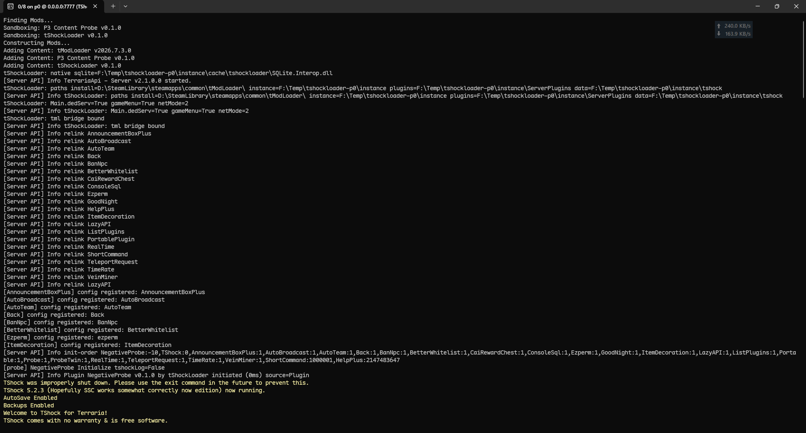
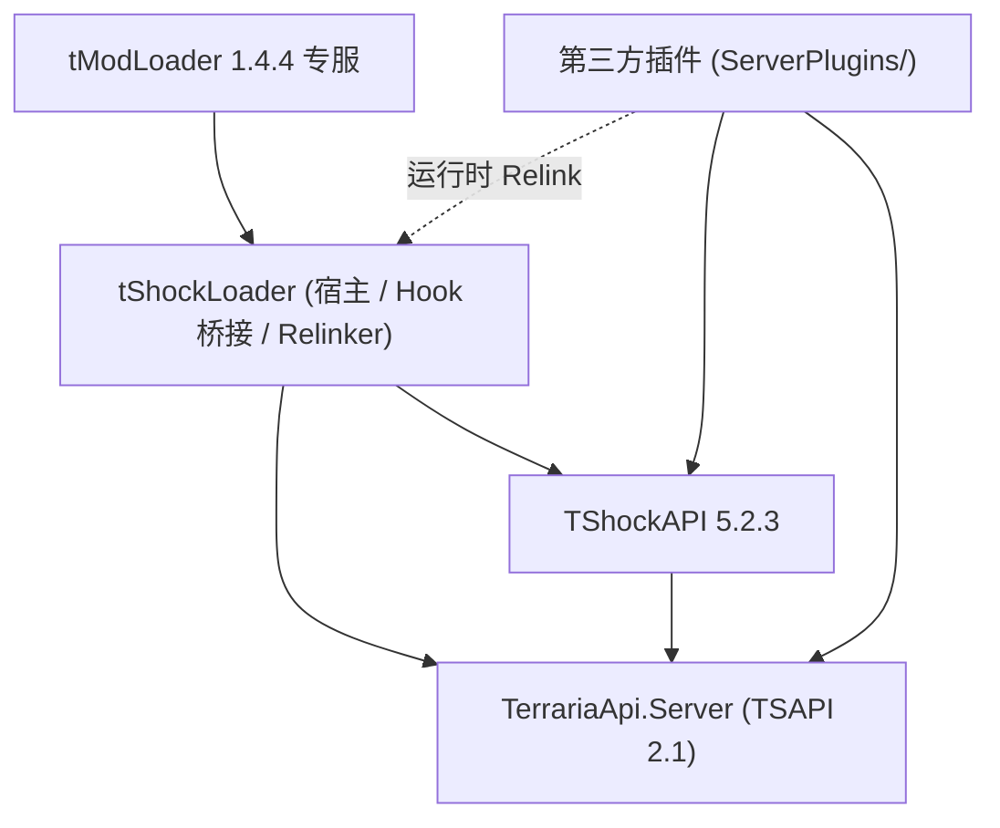
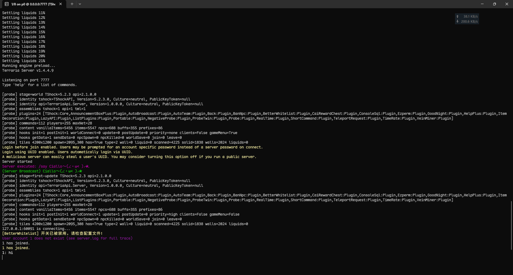

# tShockLoader

<div align="center">

**用于 tModLoader 1.4.4 Dedicated Server 的 TShock 5.2 加载器与适配层**

[](https://github.com/tModLoader/tModLoader)
[](https://github.com/Pryaxis/TShock)
[](https://github.com/Pryaxis/TSAPI)
[](https://dotnet.microsoft.com/)
[](LICENSE)

[安装与部署](docs/install.md) • [配置与权限](docs/configuration.md) • [插件兼容矩阵](docs/compatibility.md) • [插件开发](docs/plugin-development.md) • [常见问题](docs/faq.md)

</div>

---

## 项目介绍

tShockLoader 用于在 tModLoader 1.4.4 专服上运行 TShock 5.2.3（TSAPI 2.1）。

通过单个 `tShockLoader.tmod` 文件，让 tModLoader 专服支持 TShock 的账号认证、权限组、管理指令、REST API 以及大部分基于 TSAPI 2.1 编译的第三方插件。



---

## 功能概述

- **TShock 基础管理**：内置 TShock 5.2.3，支持用户注册、权限组继承、封禁、白名单、区域保护与 REST API。
- **单文件分发**：核心组件与依赖打包在 `tShockLoader.tmod` 内，放入 `Mods/` 即可加载。
- **内容与协议适配**：
  - 适配 tModLoader 的动态内容注册（物品、NPC、方块、Buff、前缀等 ID 上限）。
  - 自动放行 tModLoader 扩展数据包（ModPacket/ModFile 249–253），原版数据包仍受 TShock 权限与反作弊规则控制。
- **插件兼容（Relinker）**：内置运行时重写器，将针对原版 TShock 5.2.3 编译的第三方插件映射到 tModLoader 与 FNA 运行时。
- **目录隔离与多实例**：默认将配置、数据库（`tshock/`）和插件（`ServerPlugins/`）写入专服目录下的 `tShockLoader/`，可用 `-instancepath` 覆盖。

---

## 架构



- **tModLoader**：游戏状态、内容注册与网络协议的实现基础。
- **tShockLoader**：管理生命周期、安装底层 Hook、提供程序集解析并加载插件。
- **TerrariaApi.Server**：提供 TSAPI 2.1 插件接口与事件定义。
- **TShockAPI**：负责账号、权限、命令分发、数据存储与 REST API。

---

## 快速开始

### 1. 运行要求

- **操作系统**：Windows x64 / Linux x64
- **运行时**：[.NET 8.0 Runtime](https://dotnet.microsoft.com/download/dotnet/8.0)
- **专服版本**：tModLoader `1.4.4.9+2026.07.3.0`（Steam 专服即可）

### 2. 安装与启用

1. 在 [Releases](https://github.com/Megghy/tShockLoader/releases) 下载 `tShockLoader.tmod`。
2. 放入服务端的 `Mods/` 目录。
3. 在 `Mods/enabled.json` 中添加 `"tShockLoader"`：
   ```json
   [
     "tShockLoader"
   ]
   ```

### 3. 启动专服

**Windows (PowerShell):**
```powershell
dotnet ./tModLoader.dll -server -config ./serverconfig.txt -tmlsavedirectory ./save
```

**Linux (Bash):**
```bash
dotnet ./tModLoader.dll -server -config ./serverconfig.txt -tmlsavedirectory ./save
```

### 4. 设置超级管理员

1. 首次启动时，控制台会输出初始认证码（Setup Token）。
2. 进入游戏后输入 `/setup <Token>`。
3. 按提示使用 `/user add <用户名> <密码> superadmin` 创建管理员账号。
4. 使用 `/login <用户名> <密码>` 登录。

---

## 目录结构

```text
Server_Root/
├── tModLoader.dll             # tModLoader 专服主程序
├── Mods/
│   ├── enabled.json           # 模组启用列表
│   └── tShockLoader.tmod      # 发行文件
└── tShockLoader/             # 默认实例目录（可用 -instancepath 覆盖）
    ├── ServerPlugins/         # 第三方插件 (.dll)
    └── tshock/                # TShock 数据目录
        ├── config.json        # 配置文件
        ├── tshock.sqlite      # 数据库
        └── logs/              # 运行日志
```

> **注意**：请勿将 `TShockAPI.dll` 或 `TerrariaApi.Server.dll` 放入 `ServerPlugins/` 目录，核心程序集已内置于 `.tmod` 中。

---

## 插件支持

将针对 TShock 5.2.3 编译的插件 `.dll` 放入 `tShockLoader/ServerPlugins/` 目录，启动服务器即可自动加载。可通过 `/plugins` 指令查看加载状态。

部分已验证插件：`ListPlugins`、`ConsoleSql`、`HelpPlus`、`RealTime`、`TimeRate`、`LazyAPI` 及其常用组件（AutoBroadcast、Back、VeinMiner 等）。

详情参见 [插件兼容矩阵](docs/compatibility.md)。



---

## 文档索引

- [安装与部署指南](docs/install.md)
- [配置与权限说明](docs/configuration.md)
- [插件兼容矩阵](docs/compatibility.md)
- [插件开发说明](docs/plugin-development.md)
- [常见问题与排查](docs/faq.md)
- [版本与支持清单](docs/versions.md)

---

## 许可证

- 遵循 **GPL-3.0** 许可证，详见 [LICENSE](LICENSE)。
- 包含 TShock 与 TSAPI 上游版权声明，详见 [NOTICE](NOTICE)。
